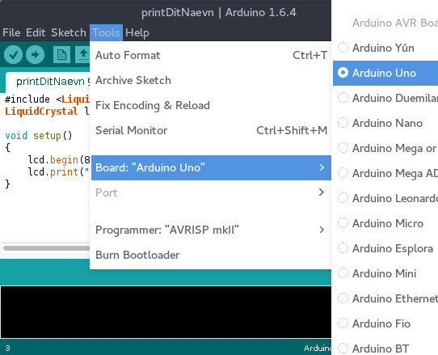
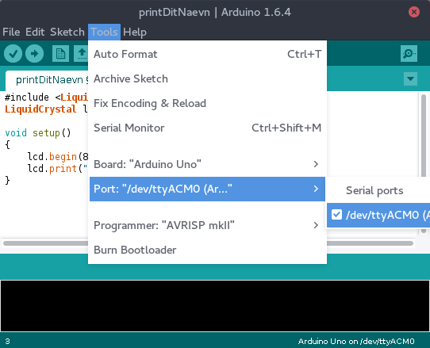
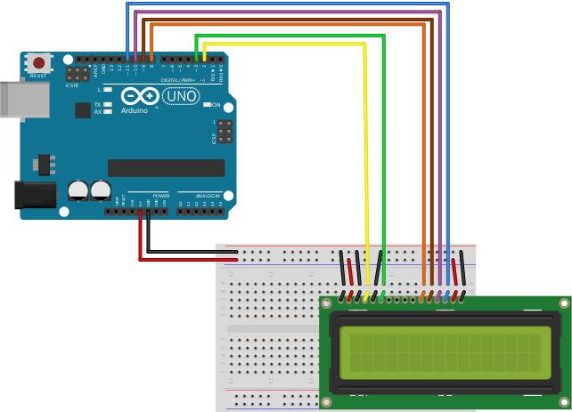
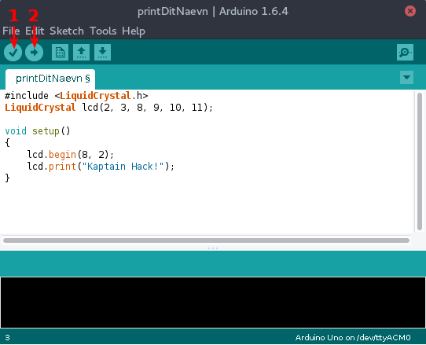

# 1. trin: Print dit navn på en skærm

## Installation af Arduino IDE

Du kan finde programmet [her](https://www.arduino.cc/en/Main/Software).

Hvis du bruger ubuntu, kan programmet installeres
ved denne kommando i terminalen:
```
sudo apt-get install arduino
```

## Configuration af Arduino IDE

Indstill board typen:



Arduino'en skal forbindes til din computer gennem et almindeligt USB kabel.
Det almindelige USB stik sættes ind i computerens USB port, mens
den anden del (større stik) af kablet sættes in i arduino'en.

Til sidst skal du indstille programmet hvor det kan finde arduino'en:



## Board



## Kode

```C
#include <LiquidCrystal.h>
LiquidCrystal lcd(2, 3, 8, 9, 10, 11);

void setup()
{
    lcd.begin(8, 2);
    lcd.print("Kaptain Hack!");
}

void loop()
{
}
```

## Køre koden

Man burde nu kunne starte arduino programmet ved at klikke
først på ikonen markeret 1. Nu bliver koden kompileret.
Bagefter kan du sende programmet til arduino'en ved at
klikke på ikonen markeret 2.



## Lidt mere dynamisk

```C
#include <LiquidCrystal.h>
LiquidCrystal lcd(2, 3, 8, 9, 10, 11);

void setup()
{
    lcd.begin(8, 2);
    lcd.print("Kaptain Hack!");
}

void loop() {
    lcd.setCursor(0,1);
    lcd.print(millis() / 1000);
}
```

## Tegne smileys

```C
#include <LiquidCrystal.h>
LiquidCrystal lcd(2, 3, 8, 9, 10, 11);

// Define 2 smileys.
byte surprisedSmiley[8] = {
  B10001,
  B10001,
  B00000,
  B00000,
  B01110,
  B10001,
  B01110
};

byte winkSmiley[8] = {
  B00000,
  B11001,
  B00000,
  B00000,
  B10001,
  B01110,
  B00000
};

void setup()
{
    // Register the smileys.
    lcd.createChar(0, winkSmiley);
    lcd.createChar(1, surprisedSmiley);

    // Initialize the LCD display.
    lcd.begin(8, 2);
}

void loop()
{
    // Print the 1st smiley to display.
    lcd.setCursor(0,0);
    lcd.write(byte(0));

    // Pause execution.
    delay(1000);

    // Print the 2nd smiley to display.
    lcd.setCursor(0,0);
    lcd.write(byte(1));

    // Pause execution.
    delay(1000);
}
```
