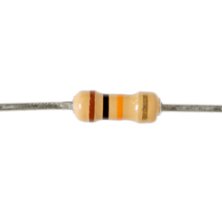

# 2. trin: Tilføj en knap


## Board


OBS!
Læg mærke til farverne på den resistor.
Farvekodet tyder på modstandens værdi.


I vores elektrisk kredsløb bruger vi en 10k ohm resistor.



## Kode

``` c
// Define input and output pins.
const int buttonPin = 12;
const int ledPin =  13;

void setup()
{
    // initialize the LED pin as an output:
    pinMode(ledPin, OUTPUT);
    // initialize the pushbutton pin as an input:
    pinMode(buttonPin, INPUT);
}

void loop()
{
    // read the state of the pushbutton value:
    int buttonState = digitalRead(buttonPin);

    // check if the pushbutton is pressed.
    // if it is, the buttonState is HIGH:
    if (buttonState == HIGH)
    {
        // turn LED on:
        digitalWrite(ledPin, HIGH);
    }
    else
    {
        // turn LED off:
        digitalWrite(ledPin, LOW);
    }
}
```
## Udfordring

Prøve at bygge en kredsløb, der består at både en knap og en skærm.
Skrive så et program der printer på skærmen
hvor ofte du har trykket på knappen.

Du kan finde et eksempel [her](udfordring/udfordring.ino)
