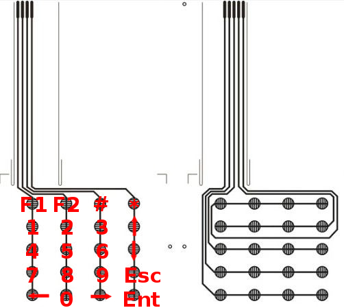
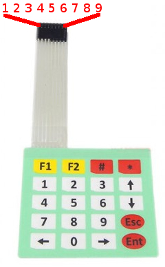

# 3.trin: Brug knapperne på et tastatur

I stedet for en masse knapper vil vi bruge et tastatur med flere knapper.


<!--  -->

## Hvordan?

En kredsløb med flere knapper kan blive meget kompleks,
fordi knapper bruger strøm og hver knap tag en digital pin på arduino'en.

Til gengæld har et tastatur med 20 knapper kun behov for 9 digitale pins.
Kan du forklare hvorfor?



## Board

Forbind tastaturets 9 output pins med 9 digitale pins på arduino'en:

- Første output pin med digital pin 1.
- Anden output pin med digital pin 2.
- osv.



## Kode

Inden vi kan starte, skal 'Keypad' biblioteket installeres.


```C
#include "Keypad.h"

// Define dimensions.
const byte rows = 4;
const byte cols = 5;

// Define string for each key.
const char * keys[rows][cols] =
{
    {"F1",   "F2", "#",     "*"},
    {"1",    "2",  "3",     "up"},
    {"4",    "5",  "6",     "down"},
    {"7",    "8",  "9",     "Esc"},
    {"left", "0",  "right", "Ent"}
};

// Define row pins.
byte rowPins[rows] = {1, 2, 3, 4};

// Define column pins.
byte colPins[cols] = {5,6,7,8,9};

// Initialize the keypad.
Keypad keypad = Keypad(makeKeymap(keys), rowPins, colPins, rows, cols);

void setup()
{
    // Initialize a connection to the terminal.
    Serial.begin(9600);
}

void loop()
{
    // Retrieve a key.
    char key = keypad.getKey();

    // Verify if a key is pressed.
    if (key != NO_KEY)
    {
        // Print result to terminal.
        Serial.println(key);
    }
}
```

Ved ```Ctrl + Shift + M``` få du en terminal der er forbundet med arduino'en.
I terminalen kan du se signaler fra arduino'en mens programmet kører.

## Tastatur og skærm

Prøv at bygge en kredsløb med báde en skærm og et tastatur.
Skriv så et program sådan at men kan bruge tastaturet til at skrive et nummer på skærmen.
