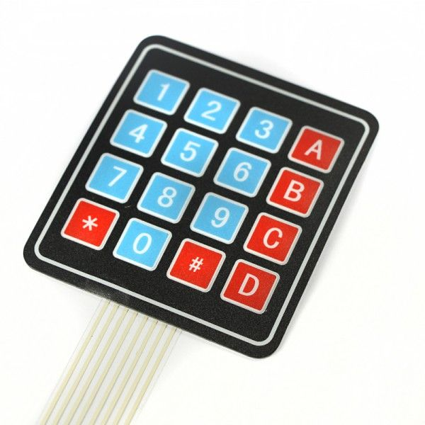

# 3.trin: Brug knapperne på et tastatur

I stedet for en masse knapper vil vi bruge et tastatur med flere knapper.



## Hvordan?

En kredsløb med flere knapper kan blive meget kompleks,
fordi knapperne bruger strøm og hver knap tag en digital pin på arduino'en.

Til gengæld har et tastatur med 16 knapper kun behov for 8 digitale pins.
Kan du forklare hvorfor?


## Board

Forbind tastaturets 8 output pins med 8 digitale pins på arduino'en:

- Første output pin med digital pin 13.
- Anden output pin med digital pin 12.
- osv.


## Kode

Inden vi kan starte, skal 'Keypad' biblioteket installeres.


```C
#include "Keypad.h"

// Define dimensions.
const byte rows = 4;
const byte cols = 4;

// Define string for each key.
char keys[rows][cols] = {
    {'1', '2', '3', 'A'},
    {'4', '5', '6', 'B'},
    {'7', '8', '9', 'C'},
    {'*', '0', '#', 'D'}
};

// Define row pins.
byte rowPins[rows] = {13, 12, 11, 10};

// Define column pins.
byte colPins[cols] = {9, 8, 7, 6};

// Initialize the keypad.
Keypad keypad = Keypad(makeKeymap(keys), rowPins, colPins, rows, cols);

void setup()
{
    // Initialize a connection to the terminal.
    Serial.begin(9600);
}

void loop()
{
    // Retrieve a key.
    char key = keypad.getKey();

    // Verify if a key is pressed.
    if (key != NO_KEY)
    {
        // Print result to terminal.
        Serial.println(key);
    }
}
```

Ved ```Ctrl + Shift + M``` få du en terminal der er forbundet med arduino'en.
I terminalen kan du se signaler fra arduino'en mens programmet kører.

## Tastatur og skærm

Prøv at bygge en kredsløb med både en skærm og et tastatur.
Skriv så et program sådan at men kan bruge tastaturet til at skrive et nummer på skærmen.

Du kan finde et eksempel [her](./keypadAndLcd/keypadAndLcd.ino)
