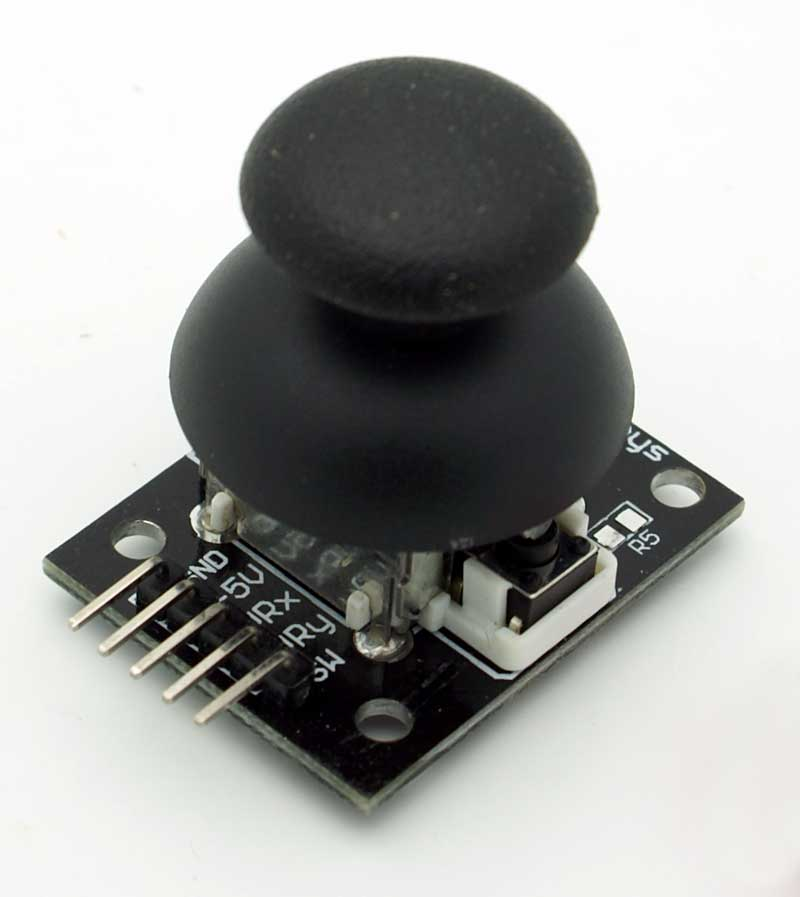
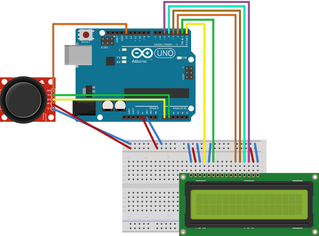
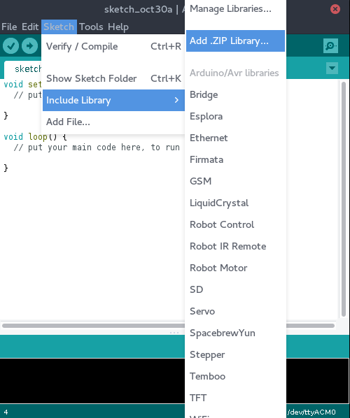

# 2. trin: Tilføj en joystick




## Board



## Kode

Inden vi kan starte, skal 'Joystick' biblioteket installeres.
Download [Joystick.zip](../Joystick.zip) og installer biblioteket
i Arduino programmet



```C
#include <LiquidCrystal.h>
#include <Joystick.h>

LiquidCrystal lcd(0, 1, 2, 3, 4, 5);
Joystick joystick(1, 0, 13);

void setup()
{
    joystick.begin();
    lcd.begin(2, 16);
}

void loop()
{
    JoystickPosition position = joystick.position();

    lcd.setCursor(0, 0);
    lcd.print(position.x);

    lcd.setCursor(0, 1);
    lcd.print(position.y);
}
```
