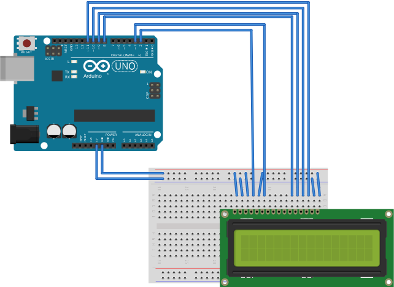
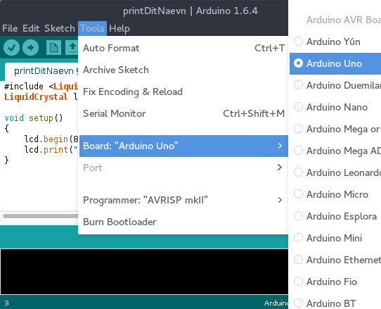
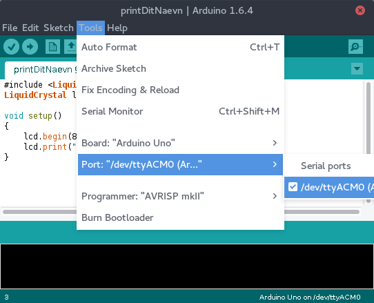
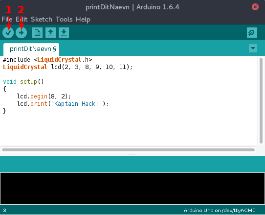

# 1. trin: Print dit nævn på en skærm

## Installation

Du kan finde programmet [her](https://www.arduino.cc/en/Main/Software).


## Board



## Print dit nævn





```C
#include <LiquidCrystal.h>
LiquidCrystal lcd(2, 3, 8, 9, 10, 11);

void setup()
{
    lcd.begin(8, 2);
    lcd.print("Kaptain Hack!");
}
```

## Lidt mere dynamisk

```C
#include <LiquidCrystal.h>
LiquidCrystal lcd(2, 3, 8, 9, 10, 11);

void setup()
{
    lcd.begin(8, 2);
    lcd.print("Kaptain Hack!");
}

void loop() {
    lcd.setCursor(0,1);
    lcd.print(millis() / 1000);
}
```
